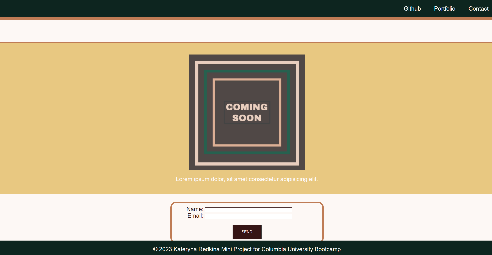

# Mini Project

## Description

It is a  mini-project, where we built a landing page using HTML and CSS.

## Installation

To install the project on your local machine:

1) Clone or download the repository to your own local machine.
2) Open the HTML file in your browser.

## Links

[Link to the deployed website](https://kateredkina.github.io/landing-page-mini-project1/)

[Link to the code repository](https://github.com/KateRedkina/landing-page-mini-project1)

## Usage

Once deployed the application can be viewed in a traditional desktop web browser.
It it not yet optimized for smaller screens.

